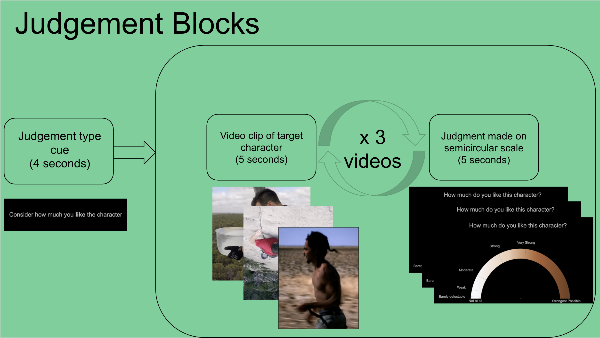
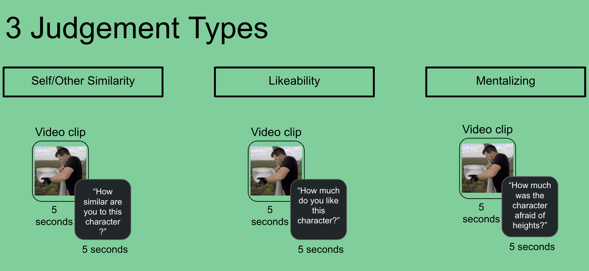
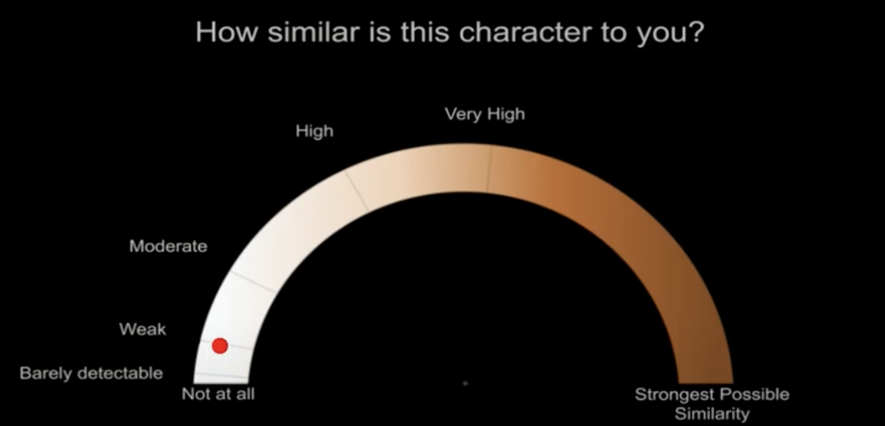

# shortvideos

### Purpose
The goal of the short videos task is to produce data capable of training a sensitive and specific neural signature of self-reference. 

### Paradigm
In this task, participants complete 21 blocks of 3 trials. 

In each block, they are asked to make one type of judgement for three different videos
in a row.

To make ratings, participants are shown a semi-circular rating scale with a prompt to make a specific rating. A red dot begins 
equidistant from all points on the scale.

Participants then use a trackball in the scanner to move the red dot to the appropriate area on the scale that matches their rating.
They then click a button to submit their response.

Videos are all approximately 5 seconds long. After each video participants give a rating on a semi-circular scale
ranging from 'not at all' to 'most imaginable'. The three classes of ratings they make are:
1. Self-similarity (i.e. "how similar are you to this character")
2. Likeability (i.e. "how much do you like this character?")
3. Mentalizing (e.g. "how much was this character afraid of heights?")
    * Note two unique characteristics of the mentalizing question:
        * The rating scale will not measure how 'much' mentalizing the participant was doing
        * There are 7 different mentalizing questions because no single mentalizing question related directly to every video. 
        The different questions insure that there is more variance in mentalizing across videos.
        
Each judg
        
Below is a screenshot of 3 possible rating scales:
1. Self-similarity

        
### Running the Code
To do

### Folder Structure and Description
To do